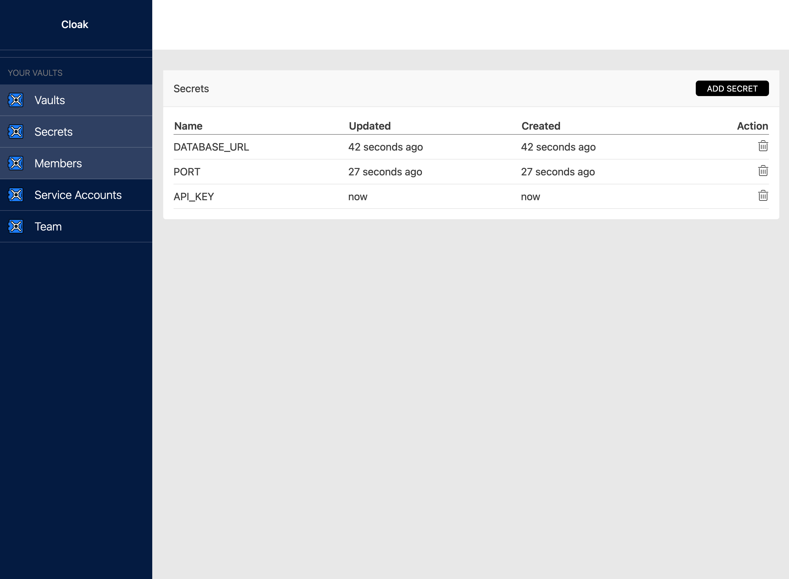

## End 2 End Encrypted Secrets Manager for Operations and Development

* Uses standard encryption algorithms so that we never see your secrets.
* CLI tool to bring secrets from the vault to you local environemnt.
* Hosted by us or on your own infrastructure, runs as docker containers.
* Permissive licence.
* User interface to manage teams, add secrets and manage service accounts.
* Role based access control, give users admin access to manage their own teams.

## Developers

Cloak uses [Rust on Nails](https://rust-on-nails.com/) architecture.