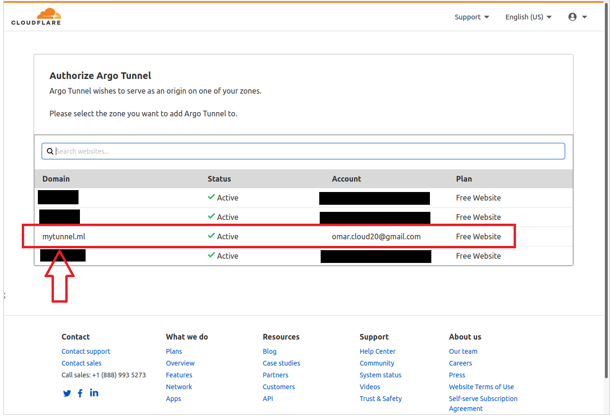

+++
title = "How to setup a Cloudflare tunnel as a Kubernetes ingress"
date = 2022-01-20
[extra]
listing_image = "blog/cloudflare-tunnels-for-k8-ingress/cloudflare-tunnel.png"
+++


A quick way to get HTTPS ingress into a Kubernetes cluster is to deploy the cloudlared container as a deployment or  sidecar. 

Follow [the instructions](https://documentation.cloudflare.com/cloudflare-one/connections/connect-apps/install-and-setup/installation) for setting up `cloudflared` on your local machine.

## 1. Certificate Generation

So that `cloudflared` can authenticate itself when running inside your cluster we need to generate a certificate.

```bash
$ cloudflared tunnel login
Please open the following URL and log in with your Cloudflare account:

https://dash.cloudflare.com/argotunnel?callback=https%3A%2F%2Flogin.cloudflareaccess.org%2FKBaalkLO7bp_y5_GhYtK8G1Pb_PlvTw84viVCRXP40Q%3D

Leave cloudflared running to download the cert automatically.
```

Select the domain you wish to attach the tunnel to.



After which `cloudflared` confirms the certificate has been downloaded.

```bash
If you wish to copy your credentials to a server, they have been saved to:
/home/user/.cloudflared/cert.pem
```

## 2. Getting the secret into Kubernetes

Store the cert.pem file as a secret in Kubernetes. 

```bash
kubectl --namespace=$NAMESPACE create secret generic \
   cloudflare-cert \
   --from-file=${HOME}/.cloudflare/cert.pem
```

## 3. Deploying cloudlared into Kubernetes

As we are using [Pulumi](https://www.pulumi.com) for our infrastructure as code solution we can show you how the deployment for `cloudflared` looks like in Typescript, which is pretty close to how the Kubernetes YAML would look.

The main thing to note is that you need to use a subdomain of your domain i.e. tunnel.yourddomain.com. After that if you want your root domain to point to the tunnel, you can use a CNAME in your domain setup.

```typescript
const HOST_NAME = 'yourdomain'
const DESTINATION_HOST = 'your-kubernetes-deployment'

const cloudflaredPod = new kx.PodBuilder({
    imagePullSecrets: [{ name: 'image-pull' }],
    containers: [{
        name: "tunnel",
        image: "cloudflare/cloudflared:2021.11.0",
        command: ["cloudflared", "tunnel"],
        args: [
            `--url=http://${DESTINATION_HOST}:7100`,
            `--hostname=${HOST_NAME}`,
            "--origincert=/etc/cloudflared/cert.pem",
            "--no-autoupdate"
        ],
        volumeMounts: [{
            name: "tunnel-secret-volume",
            mountPath: "/etc/cloudflared/"
        }],
    }],
    volumes: [{
        name: "tunnel-secret-volume",
        secret: {
            secretName: `cloudflare-cert-${NAMESPACE}`,
            items: [
                { key: "cert.pem", path: "cert.pem" }
            ]
        }
    }]
})
```

### 4. Finally

You should now be able to access the web server in your cluster from `tunnel.yourdomain.com`.