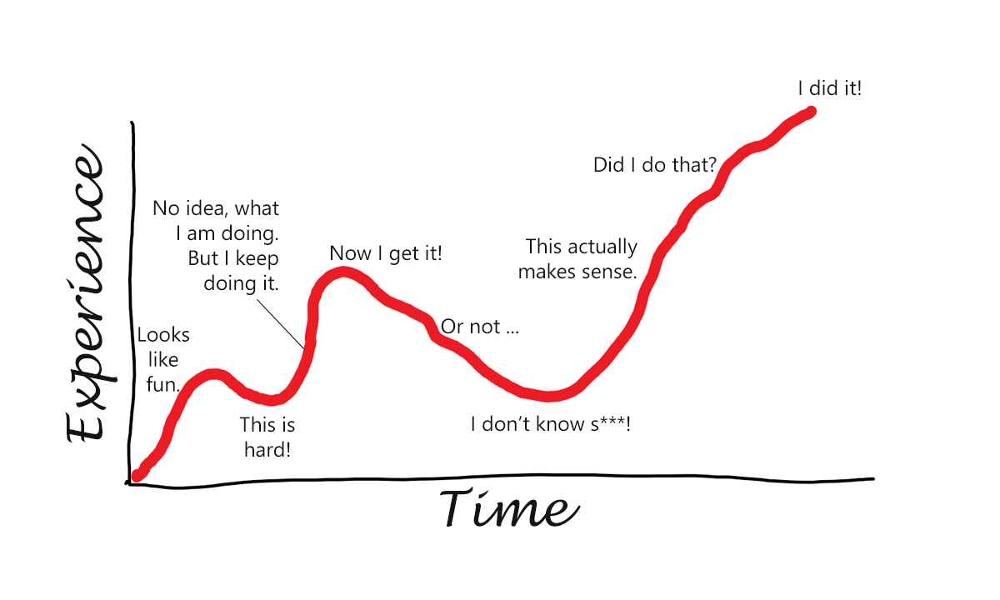

+++
title = "I built a startup in Rust, I would do it again."
date = 2023-03-09
[extra]
main_image = "blog/i-built-startup-in-rust/steep-learning-curve.png"
listing_image = "blog/i-built-startup-in-rust/steep-learning-curve.png"
+++

## Software engineering best practices are always faster

Best practices lead to faster development. 

In my experience a team following best practices will be building product quicker that teams that are not.

Let's take a look at **Continuous Integration/Deployment**. It's a best practice. Does it make me go faster? Well yes. It forces me to run tests before deployment and have code that builds from scratch. It means the code in production is more reliable and reproducible.

**There's a problem however** CI/CD is not easy to setup. There's a learning curve going from no experience to your first working pipeline.

So you might avoid building your CI/CD pipeline to feel you're going faster. But actually, you're going slower.

## Learning curves and Architecture Decisions



The road to a complete full stack architecture that supports your business is hindered by learning curves that you have to climb to reach full development speed.

An architecture is a long list of decisions that need to be made which trigger a bunch of learning curves for the team.

An experienced team will be faster as they've hopefully hit a lot of the curves earlier on in their career.

### Reusable Learning Curves

There are some architecture decisions you can re-use on different projects, different companies and perhaps throughout your career.

Basically you **go up a learning curve one time** and that skill might get re-used for the next decade.

Here's some learning curves you could go up that will probably be useful for 10 years or more.

* _Kubernetes_. Learn one way to deploy an application and learn it well. re-use across cloud providers.
* _Docker_. The way to package a binary and make it work anywhere.
* _Postgres_. If you learned Postgres back in the early 90's your probably happy with that investment.
* _Pulumi_. Infrastructure as code. 
* _HTML_, _CSS_ and _Typescript_. 

If you're looking for something new to learn and you don't have one of the above, maybe it's time.

### Learning Curves that build on each other

If you've invested time in the Docker learning curve then that gives you a head start into Kubernetes.

Another tool I like is [Earthly](https://earthly.dev/), I can re-use my Docker knowledge to create build files. So rather than learning a new syntax I get a learning curve super boost.

So we can save time with decisions that build on each other.

### Mandatory but not re-usable.

You might have to use a vendor system or a tool specific to your startup/company or your project.

You have to learn them to do your job but they are useless outside your current environment.

Sorry if that's you. We want to avoid these if possible.

## A tech startup is around 50-100 architecture decisions.

I know this because I've worked on projects where we recorded each decision in a markdown file. So called [Architecture Decision Records](https://adr.github.io/)


Recording your decisions is a best practice in my opinion.

In fact I published my decisions (or most of them anyway) into a website. [Rust on Nails](https://rust-on-nails.com).

Some of these decisions could be split into even more. For example you might decide to use React for the front end, now you could make decisions around which UI library to use, how to handle state, etc etc.

There's a lot to learn.

People who build full stack systems are incredibly talented and very rarely fully appreciated.

## Is Rust Hard?

It implements more software engineering best practices than other languages. 

They take more time to learn.

However, my experience with working with developers on their first Rust project is that they are **building something that works within days**.

After a few weeks they would be able to write the same functionality with less code. 

An example of this is moving away from nested if expression to using tuples and destructuring.

```rust
if let Ok(var1) = env::var("VAR_1") {
    if let Ok(var2) = env::var("VAR_2") {
        ...
    }
}
```

to something like this

```rust
if let (Ok(var1), Ok(var2)) = (env::var("VAR_1"), env::var("VAR_2")) {
    // Cool, var1 and var2 have destructured from the tuple
}
```

Figuring these things out is fun.

## Yeah but what about lifetimes?

They don't turn up that much. Not for me anyway.

The [source code](https://github.com/purton-tech/cloak) for Cloak has hardly any. 

This is because Rust now has [Lifetime Elision](https://doc.rust-lang.org/reference/lifetime-elision.html), meaning the syntax appears less often.

## Speed of development

One of the arguments I've seen against Rust goes something like

> Slower iterations. When you first start with Rust, you’ll end up fighting the compiler a bit. This is natural and gets easier over time. However, at a new startup, one of the core problems is to figure out if you are building something useful.

You're not **fighting the compiler** you're **fixing bugs**. 

When software hits production it sets like concrete. It doesn't want to change any more and changes can be catastrophic anyway. It's the worst place to fix bugs.

The Rust compiler is a thousand unit tests that you don't have to write, it's your best friend that never stops loving you.

## CONTRIBUTING.md

> Developer onboarding is the process of integrating a new developer into your business. The strength of your developer onboarding program can make or break your team. This includes getting your new developer acquainted with the organizational, technical, and social procedures of the company.

Does Rust limit your ability to on-board developers?

The decisions you make for your full stack will have an impact on developer onboarding.

There are also things you can do to speed up the process regardless of your architecture a few of those things are.

1. Development Environment as Code. Can you go from zero to full developer environment in a few minutes. See [Dev Containers](https://docs.github.com/en/codespaces/setting-up-your-project-for-codespaces/adding-a-dev-container-configuration/introduction-to-dev-containers)
1. Architecture Decision Records. Can you point a developer at what decisions were made and why.
1. A lot of projects have a **CONTRIBUTING.md** markdown file with the steps needed to get productive.

It's not necessarily true that an experienced Rust developer will on-board quicker than a Rust newbie. Maybe the newbie has hit nearly every other learning curve on your stack.

So there's an opportunity.

Hire people with a wide range of skills and tempt them in with Rust. 

## Rust will handle everything you throw at it

Rust supports a lot of software engineering best practices which make us faster and our software more reliable.

Whether you build for embedded devices, the web, games, data science or pretty much any software project Rust has got you covered.

It's a reusable learning curve resulting in skills that will be valid for another decade or more.

So if you make an architecture decision to choose Rust then, well done, you nailed it. Let's hope you get all the other decisions right too.

## Conclusion

Pick technical learning curves that give the maximum total value in best practices and transferability.

I'm happy that one of the decisions I made for my startup was Rust. My development cycle will be faster, my startup more stable, and I can take that skill on to other projects.