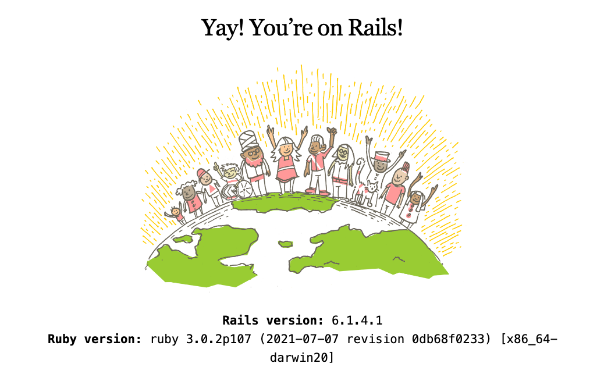

+++
title = "Rust on Nails"
date = 2022-03-16
+++

## A full stack architecture for Rust web applications



To build a web application you need to make architecture decisions across a range of topics. The beauty of [Ruby on Rails](https://rubyonrails.org/) or [Django](https://www.djangoproject.com/) is that they make those decisions for you so you can start building your web application straight away. They also back those decisions up with great documentation.

**Rust on Nails** is a framework leveraging existing solutions that fulfill the needs of a full stack development. We look at each decision that needs to be made then pull in solutions and package everything up so that it works together. It's an opinionated framework and it's how Cloak was built see the [Cloak Github Repo](https://github.com/purton-tech/cloak).

Here's a breakdown of the services, decisions and best practices covered.

1. [Development Environment as Code](#development-environment-as-code)
1. [The Web Server and Routing](#the-web-server-and-routing)
1. [Choosing a Database](#the-database)
1. [Configuration](#configuration)
1. [Database Migrations](#database-migrations)
1. [Database Access](#database-access)
1. [HTML Templating](#html-templating)
1. [Form Handling and Validation](#forms)
1. [Asset Pipeline](#asset-pipeline)
1. [Cache busting and images](#cache-busting-and-images)
1. [Layouts](#layouts)
1. [Front End Enhancement](#front-end-enhancement)
1. [Partials and Components](#partials-and-components)
1. [Sending Email](#sending-email)
1. [Authentication](#authentication)
1. [Integration Tests](#integration-tests)

Let's get started.

## Development Environment as Code.

The [Visual Studio Code Remote - Containers](https://code.visualstudio.com/docs/remote/containers) extension lets you use a Docker container as a full-featured development environment. This fixes the following problems

* Enables developers other than yourself to get quickly up to speed
* Stops issues such as "It works on my machine"
* Allows you to check your development environment into git.

Install the devcontainer extension in VSCode and then setup a Rust environment.


The select *Open folder in container...* Select Rust and Postgres. Also select node on the next menu.


How you folder structure will look.

```sh
.
├── .cargo/
└── .devcontainer/
    ├── .env
    ├── devcontainer.json
    ├── docker-compose.yml
    └── Dockerfile
```

We are going to create a workspace for our web application. Create a new `Cargo.toml` file in the root folder and add the foloowing.

```toml
[workspace]
members = [
    "app",
]
```

The run the following command.

```
$ cargo new app
```

You should now have a folder structure like the following.

```sh
├── .devcontainer/
│   └── ...
└── app/
│   ├──src/
│   │  └── main.rs
│   └── Cargo.toml
├── Cargo.toml
└── Cargo.lock
```

Test out you development environment with

```
$ cargo run
   Compiling app v0.1.0 (/workspace/app)
    Finished dev [unoptimized + debuginfo] target(s) in 1.16s
     Running `target/debug/app`
Hello, world!
```

## The Web Server and Routing

We looked at [Actix Web](https://actix.rs/), [Tokio Axum](https://github.com/tokio-rs/axum) and [Rocket](https://rocket.rs/). Axum was chosen as it's very actively maintained and has the fastest incremental build times. 

Most rust web server project operate in a similar way. That is you configure a route and a function that will respond to that route.

The functions that respond to routes can have parameters. These parameters which might be `structs`, database pools or form data are passed to the function by the framework. 

Add the following to your `app/Cargo.toml`.

```toml
[dependencies]
axum = "0"
tokio = { version = "1", default-features = false, features = ["macros", "rt-multi-thread"] }
```

And update your `app/src/main.rs`

```rust
use axum::{response::Html, routing::get, Router};
use std::net::SocketAddr;

#[tokio::main]
async fn main() {
    // build our application with a route
    let app = Router::new().route("/", get(handler));

    // run it
    let addr = SocketAddr::from(([127, 0, 0, 1], 3000));
    println!("listening on {}", addr);
    axum::Server::bind(&addr)
        .serve(app.into_make_service())
        .await
        .unwrap();
}

async fn handler() -> Html<&'static str> {
    Html("<h1>Hello, World!</h1>")
}
```

Issue the command

```sh
cargo run
```

And you should be able to point your browser at `http://localhost:3000` and see the web server deliver **Hello World**.

## The Database

> If you're not sure which database to use then use Postgres.

The architecture doesn't stop you using MySQL (MariaDB?) or other relational databases. However a relational database is the recommendation.

We already installed Postgres when we installed our *devcontainer*, however we didn't install the Postgres command line client. To do that, add the following to your `.devcontainer/Dockerfile`.

```
# Install psql 14
RUN sh -c 'echo "deb http://apt.postgresql.org/pub/repos/apt $(lsb_release -cs)-pgdg main" > /etc/apt/sources.list.d/pgdg.list' \
   && wget --quiet -O - https://www.postgresql.org/media/keys/ACCC4CF8.asc | apt-key add - \
   && apt-get -y update \
   && apt-get -y install postgresql-client \
   && apt-get autoremove -y && apt-get clean -y
```

Add the following to your `.devcontainer/.env`

```
DATABASE_URL=postgresql://postgres:postgres@db:5432/postgres?sslmode=disable
```

Restart your devcontainer and you should now have access to Postgres. i.e.

```
psql $DATABASE_URL
psql (14.2 (Debian 14.2-1.pgdg110+1), server 14.1 (Debian 14.1-1.pgdg110+1))
Type "help" for help.

postgres=# \dt
Did not find any relations.
postgres=# \q
```

We will use this pattern over and over. When we add a tool to our solution we add it to the devcontainer this ensures we can always reproduce our development environment. 

## Configuration

To configure our application we pull in environemnt variables a create a Rust struct. Create a `app/src/config.rs`.

```rust
#[derive(Clone, Debug)]
pub struct Config {
    pub database_url: String,
}

impl Config {
    // Initialise form oiur environment
    pub fn new() -> Config {
        let database_url = 
            std::env::var("DATABASE_URL")
            .expect("DATABASE_URL not set");

        Config {
            database_url,
        }
    }
}
```

```sh
.
├── .devcontainer/
│   └── ...
├── app/
│   ├──src/
│   │  ├── main.rs
│   │  └── config.rs <- Our configuration
│   └── Cargo.toml
├── Cargo.toml
└── Cargo.lock
```

## Database Migrations

[Dbmate](https://github.com/amacneil/dbmate) is a database migration tool, to keep your database schema in sync across multiple developers and your production servers.

Add the following to your `.devcontainer/Dockerfile` and rebuild your devcontainer

```
RUN sudo curl -fsSL -o /usr/local/bin/dbmate https://github.com/amacneil/dbmate/releases/latest/download/dbmate-linux-amd64 \
   && sudo chmod +x /usr/local/bin/dbmate
```

After that we can setup our migrations folder and the create a users migration.

```
$ dbmate new create_users_table
Creating migration: db/migrations/20220330110026_create_users_table.sql
```

Edit the SQL file that was generated for you and add the following.

```sql
-- migrate:up
CREATE TABLE users (
    id SERIAL PRIMARY KEY, 
    email VARCHAR NOT NULL UNIQUE, 
    hashed_password VARCHAR NOT NULL, 
    reset_password_selector VARCHAR,
    reset_password_verifier_hash VARCHAR,
    created_at TIMESTAMP NOT NULL DEFAULT NOW(),
    updated_at TIMESTAMP NOT NULL DEFAULT NOW()
);

CREATE TABLE sessions (
    id SERIAL PRIMARY KEY, 
    session_verifier VARCHAR NOT NULL, 
    user_id INT NOT NULL, 
    otp_code_encrypted VARCHAR NOT NULL,
    otp_code_attempts INTEGER NOT NULL DEFAULT 0,
    otp_code_confirmed BOOLEAN NOT NULL DEFAULT false,
    otp_code_sent BOOLEAN NOT NULL DEFAULT false,
    created_at TIMESTAMP NOT NULL DEFAULT NOW()
);

-- migrate:down
DROP TABLE sessions;
DROP TABLE users;
```

List the migrations so we can see which have run.

```
$ dbmate status
[ ] 20220330110026_create_users_table.sql

Applied: 0
Pending: 1
```

Run our new migration.

```
$ dbmate up
Applying: 20220330110026_create_users_table.sql
```

And check that it worked.

```
$ psql $DATABASE_URL -c 'SELECT count(*) FROM users;'
 count 
-------
     0
(1 row)
```

Your project folders should now look like this.

```sh
.
├── .devcontainer/
│   └── ...
├── app/
│   └── ...
├── db/
│   ├── migrations
│   │   └── 20220330110026_create_users_table.sql
│   └── schema.sql
├── Cargo.toml
└── Cargo.lock
```

## Database Access

[SQLx](https://github.com/launchbadge/sqlx) is amazing. It's An async, pure Rust SQL crate featuring compile-time checked queries without a DSL. Supports PostgreSQL, MySQL, SQLite, and MSSQL.

Add the following to your `app/Cargo.toml`

```
sqlx = { version = "0", default-features = false,  features = [ "runtime-tokio-rustls", "postgres", "macros", "chrono" ] }
```

Add the following code to a file called `app/src/models/user.rs`

```rust
use sqlx::{Error, PgPool};

pub struct User {
    pub id: i32,
    pub email: String,
}

impl User {
    pub async fn get_users(pool: &PgPool, user_id: u32) -> Result<Vec<User>, Error> {
        Ok(sqlx::query_as!(
            User,
            "
                SELECT 
                    id, email
                FROM 
                    users
                WHERE
                    id < $1
            ",
            user_id as i32
        )
        .fetch_all(pool)
        .await?)
    }
}
```

You'll also need to create a file called `app/src/models/mod.rs` and add the following

```
pub mod user;
```

We recommend creating a folder called models and adding a file for each type of entity you will manipulate with SQLx.

```sh
.
├── .devcontainer/
│   └── ...
├── app
│   ├── src/
│   │   ├── models/
│   │   │   ├── main.rs
│   │   │   └── mod.rs
│   │   ├── main.rs
│   │   └── config.rs
├── db/
│   └── ...
├── Cargo.toml
└── Cargo.lock
```

Now we can tie our database and front end together. Update your `app/src/main.rs` to become

```rust
mod config;
mod error;
mod models;

use axum::extract::Extension;
use axum::{response::Html, routing::get, Router};
use sqlx::PgPool;
use std::net::SocketAddr;

#[tokio::main]
async fn main() {
    let config = config::Config::new();

    let db_pool = PgPool::connect(&config.database_url)
        .await
        .expect("Problem connecting to the database");

    // build our application with a route
    let app = Router::new()
        .route("/", get(handler))
        .layer(Extension(db_pool))
        .layer(Extension(config));

    // run it
    let addr = SocketAddr::from(([127, 0, 0, 1], 3000));
    println!("listening on {}", addr);
    axum::Server::bind(&addr)
        .serve(app.into_make_service())
        .await
        .unwrap();
}

async fn handler(Extension(pool): Extension<PgPool>) -> Result<Html<String>, error::CustomError> {
    let users = models::user::User::get_users(&pool, 10).await?;

    let html = format!("<h1>Hello, World! We Have {} Users</h1>", users.len());

    Ok(Html(html))
}
```

The main thing to note here is that our handler gets passed in a database connection auto magically by the framework.

We also need to create a place to hold our application errors. Creat a file called `app/src/error.rs` like so.

```rust
use axum::response::{IntoResponse, Response};
use axum::http::StatusCode;

#[derive(Debug)]
pub enum CustomError {
    Database(String),
}

// So that errors get printed to the browser?
impl IntoResponse for CustomError {
    fn into_response(self) -> Response {
        let (status, error_message) = match self {
            CustomError::Database(message) => (StatusCode::UNPROCESSABLE_ENTITY, message),
        };

        format!("status = {}, message = {}", status, error_message).into_response()
    }
}

// Any errors from sqlx get converted to CustomError
impl From<sqlx::Error> for CustomError {
    fn from(err: sqlx::Error) -> CustomError {
        CustomError::Database(err.to_string())
    }
}
```

Execute `cargo run` and you can access the application from `http://localhost:3000` in your browser.

## HTML Templating

Because Rust supports macros we can create a DSL to handle our templating needs. This means we can leverage the Rust we already know to create loops and if statements.

We will use [markup.rs](https://github.com/utkarshkukreti/markup.rs). Add the following to your `app/src/Cargo.toml`.

```toml
markup = "0"
```

**Markup** templating syntax looks like what we see below. We can re-use our existing Rust knowledge for conditions and loops and get compile time help at the same time.

```rust
markup::define! {
    Page<'a>(user: &'a User, posts: &'a [Post]) {
        @markup::doctype()
        html {
            head {
                title { "Hello " @user.name }
            }
            body {
                #main.container {
                    @for post in *posts {
                        div#{format!("post-{}", post.id)}["data-id" = post.id] {
                            .title { @post.title }
                        }
                    }
                }
                @Footer { name: &user.name, year: 2020 }
            }
        }
    }

    Footer<'a>(name: &'a str, year: u32) {
        "(c) " @year " " @name
    }
}
```

## Forms

[Axum](https://github.com/tokio-rs/axum) has support for [Handlers](https://docs.rs/axum/latest/axum/handler/index.html). We can use those in a lot of different ways and one way is for form implementations. The example belows shows how we use a struct to handle the form data passed in to the `accept_form` function.

```rust
use axum::{
    extract::Form,
    handler::post,
    Router,
};
use serde::Deserialize;

#[derive(Deserialize)]
struct SignUp {
    username: String,
    password: String,
}

async fn accept_form(form: Form<SignUp>) {
    let sign_up: SignUp = form.0;

    // ...
}

let app = Router::new().route("/sign_up", post(accept_form));
```

## Asset Pipeline

The asset pipeline provides a framework to concatenate and minify or compress JavaScript and CSS assets. It also adds the ability to write these assets in other languages and pre-processors such as [Typescript](https://www.typescriptlang.org/) and [Sass](https://sass-lang.com/).

I've used [Parcel](https://parceljs.org/) on several projects and before that [Webpack](https://webpack.js.org/). I've found Parcel to be easier to use and so that is the recommendation for Nails.

To install parcel

```sh
$ cd app
$ npm install --save-dev parcel
```

Now create an `app/asset-pipeline/index.ts`

```typescript
import './scss/index.scss'
```

And also `app/asset-pipeline/scss/index.scss`

```typescript
h1 {
    color: red;
}
```

Add a scripts section to your package.json

```json
  "scripts": {
    "start": "parcel watch ./asset-pipeline/index.ts",
    "release": "parcel build ./asset-pipeline/index.ts"
  },
```

And now when you run `npm run start` parcel will generate your assets into the dist folder. We should also update our `./.gitignore` to exclude the generated files.

```
/target
.parcel-cache
/app/dist
node_modules
```

Create an empty images folder in `app/asset-pipeline/images` then your project should now look something like this.

```sh
.
├── .devcontainer/
│   └── ...
├── app
│   ├── .parcel-cache/  <-- Created by parcel for caching
│   │   └── ...
│   ├── asset-pipeline/
│   │   ├── images/
│   │   │   └── ...
│   │   ├── scss/
│   │   │   └── index.scss
│   │   └── index.ts
│   ├── dist/           <-- Where parcel builds your assets
│   │   └── ...
│   ├── node_modules/
│   │   └── ...
│   ├── src/
│   │   └── ...
│   ├── Cargo.toml
│   ├── package-lock.json
│   ├── package.json
├── db/
│   └── ...
├── .gitignore
├── Cargo.toml
└── Cargo.lock
```

## Cache Busting and Images

Cache busting is where we invalidate a cached file and force the browser to retrieve the file from the server. We can instruct the browser to bypass the cache by simply changing the filename. To the browser, this is a completely new resource so it will fetch the resource from the server. The most common way to do this is to add the hash of the file to the URL.

What we can do with Rust is take advantage of the `build.rs` mechanism which runs some code before each compile. We can generate a set of function that let us rerieve our assets and generate the necessary hashes at the same time. So for example to use the `index.css` in our code it would be nice to be able to call something like.

```rust
get_index_css() // Returns the URL with the hash.
```

The code for this is quite large so I won't publish it here. Please check out [https://github.com/purton-tech/cloak/blob/main/app/build.rs](https://github.com/purton-tech/cloak/blob/main/app/build.rs) for a full implementation.

You'll also need to add the follopwing to your `app/Cargo.toml`

```
tower-http = { version = "0", default-features = false, features = ["fs", "trace"] }

[build-dependencies]
sha1 = "0"  # Use by build.rs for cache busting.
```

Now when your build your project a helper class will be created which we will use in the next section.

## Layouts

Layouts are pieces that fit together (for example header, footer, menus, etc) to make a complete view. An application may have as many layouts as needed. 

In Nails a layout is just a function that takes HTML content and returns more HTML content. Let's put together our cache bustin strategy with our asset pipeline into a Layout we can use.

Create `app/src/layout.rs` with the following

```rust
use axum::response::Html;

pub fn layout(title: &str, content: &str) -> Html<String> {
    let layout = Layout {
        title,
        content,
    };
    Html(layout.to_string())
}

markup::define! {

    Layout<'a>(
        title: &'a str,
        content: &'a str,
    )
    {
        @markup::doctype()

        html[lang="en"] {

            head {
                meta [ charset="utf-8" ] {}
                meta [ "http-equiv"="X-UA-Compatible", content="IE=edge"] {}
                meta [ name="viewport", content="width=device-width, initial-scale=1" ] {}
                title { {title} }

                script [ src = crate::statics::get_index_js(), type="text/javascript", async=""] {}

                link [ rel = "stylesheet", type="text/css" , href = crate::statics::get_index_css()] {}
            }
            body {
                main {
                    {markup::raw(content)}
                }
            }
        }
    }
}

```

And we need to chnage our `app/src/main.rs` to include the routes for our asset pipeline and to call out to the new layout.

```rust
mod config;
mod error;
mod models;
mod layout;

use axum::extract::Extension;
use axum::{response::Html, routing::get, Router};
use sqlx::PgPool;
use std::net::SocketAddr;

#[tokio::main]
async fn main() {
    let config = config::Config::new();

    let db_pool = PgPool::connect(&config.database_url)
        .await
        .expect("Problem connecting to the database");

    // build our application with a route
    let app = Router::new()
        .route("/", get(handler))
        .merge(statics::asset_pipeline_routes())
        .merge(statics::image_routes())
        .layer(Extension(db_pool))
        .layer(Extension(config));

    // run it
    let addr = SocketAddr::from(([0, 0, 0, 0], 3000));
    println!("listening on {}", addr);
    axum::Server::bind(&addr)
        .serve(app.into_make_service())
        .await
        .unwrap();
}

async fn handler(Extension(pool): Extension<PgPool>) -> Result<Html<String>, error::CustomError> {
    let users = models::user::User::get_users(&pool, 10).await?;

    let html = format!("<h1>Hello, World! We Have {} Users</h1>", users.len());

    Ok(layout::layout("Test", &html))
}

// Error here disabled with "rust-analyzer.diagnostics.disabled": ["macro-error"]
// in .vscode/settings.json
pub mod statics {
    include!(concat!(env!("OUT_DIR"), "/statics.rs"));
}
```

## Front end enhancement

Sometimes you need to enhance server side generated HTML. There are many ways to do this for example [Stimulus](https://stimulus.hotwired.dev/), which I've used on multiple projects.

However all modern browser come with web components built in and as they are pretty simple to use it makes sense to implment client side enhancement using this technology.

An example of a very simple component create the following in `app/src/asset-pipelibne/components/hello_world.ts`.

```typescript
//define a class extending HTMLElement
class HelloWorld extends HTMLElement {
    connectedCallback () {
      this.innerHTML = 'Hello, World!'
    }
}

//register the new custom element
customElements.define( 'hello-world', HelloWorld )
```

Include the element into your `app/src/asset-pipeline/index.ts` i.e.

```typescript
import './scss/index.scss'
import './components/hello_world.ts'
```

To use the element

```html
<hello-world></hello-world>
```


## Partials and Components

Partials in Rails are a way to split your templating into more manageable chunks. We can get the same thing in Rust by using functions. So if you have a peice of template you repeat often, this can be refactored into a function.

It's a similar process for components. With [markup.rs](https://github.com/utkarshkukreti/markup.rs) we can create use our existing tempating to make libraries of reusable components.

Example 'Footer' component.

```rust
Footer<'a>(name: &'a str, year: u32) {
    "(c) " @year " " @name
}
```

## Sending Email

We can use the excellent library [Lettre](https://lettre.rs/) for sending emails. I recommend installing [Mailhog](https://github.com/mailhog/MailHog) into your `.devcontainer/docker-compose.yml` as an email catcher.

Simply add the following config.

```yaml
# MailHog is an email testing tool for developers.
smtp:
    image: mailhog/mailhog
```

Then update your `.devcontainer/.env` with some email configuration env vars.

```
SMTP_HOST: smtp
SMTP_PORT: 1025
SMTP_USERNAME: thisisnotused
SMTP_PASSWORD: thisisnotused
SMTP_TLS_OFF: 'true'
```

We then update our `app/src/config.rs`.

```rust
use std::env;

#[derive(Clone, Debug)]
pub struct Config {
    pub database_url: String,
    // Configure SMTP for email.
    pub smtp_config: Option<SmtpConfig>,
}

#[derive(Clone, Debug)]
pub struct SmtpConfig {
    // Configure SMTP for email.
    pub host: String,
    pub port: u16,
    pub tls_off: bool,
    pub username: String,
    pub password: String,
}

impl SmtpConfig {
    pub fn new() -> Option<SmtpConfig> {
        let host = env::var("SMTP_HOST");
        let username = env::var("SMTP_USERNAME");
        let password = env::var("SMTP_PASSWORD");
        let smtp_port = env::var("SMTP_PORT");

        if let (Ok(host), Ok(username), Ok(password), Ok(smtp_port)) =
            (host, username, password, smtp_port)
        {
            Some(SmtpConfig {
                host,
                port: smtp_port.parse::<u16>().unwrap(),
                tls_off: env::var("SMTP_TLS_OFF").is_ok(),
                username,
                password
            })
        } else {
            None
        }
    }
}

impl Config {
    // Initialise form oiur environment
    pub fn new() -> Config {
        let database_url = 
            env::var("DATABASE_URL")
            .expect("DATABASE_URL not set");

        Config {
            database_url,
            smtp_config: SmtpConfig::new(),
        }
    }
}
```

Create a helper function for email in `app/src/email.rs`.

```rust
use lettre::transport::smtp::authentication::Credentials;
use lettre::{Message, SmtpTransport, Transport};

pub fn send_email(config: &crate::config::Config, email: Message) {
    if let Some(smtp_config) = &config.smtp_config {
        let creds = Credentials::new(smtp_config.username.clone(), smtp_config.password.clone());

        let sender = if smtp_config.tls_off {
            SmtpTransport::builder_dangerous(smtp_config.host.clone())
                .port(smtp_config.port)
                .credentials(creds)
                .build()
        } else {
            SmtpTransport::relay(&smtp_config.host)
                .unwrap()
                .port(smtp_config.port)
                .credentials(creds)
                .build()
        };

        // Send the email
        match sender.send(&email) {
            Ok(_) => println!("Email sent successfully!"),
            Err(e) => panic!("Could not send email: {:?}", e),
        }
    }
}
```

We should now be able to form a message and call our helper function and see the results in Mailhog.


## Authentication

Probably the quickest way to add authentication to an application is with [Barricade](https://github.com/purton-tech/barricade). Barricade handles login and registration pages and connects to your Postgres database.

We've already created the tables that Barricade needs in the migrations section. so we just need to add configuration `.devcontainer/docker-compose.yml`.

```yml
  auth:
    image: purtontech/barricade:1.2.0
    env_file:
        - .env
    depends_on:
      db:
        condition: service_healthy
```

We also need to add a healthcheck to our db section so that we know when the database is ready.

```yml
  db:
    ...
    healthcheck:
      test: ["CMD-SHELL", "pg_isready -U postgres"]
      interval: 10s
      timeout: 5s
      retries: 5
```

Add the following to you `.devcontainer/.env`

```sh
# Barricade config
SECRET_KEY=190a5bf4b3cbb6c0991967ab1c48ab30790af876720f1835cbbf3820f4f5d949
ENABLE_EMAIL_OTP='true'

FORWARD_URL=app
FORWARD_PORT=3000
# Any requests that meet the following regular expressions
# with pass through. i.e. They don't require auth.
SKIP_AUTH_FOR=/static*
REDIRECT_URL='/'

# Send all email to mailhog
SMTP_HOST=smtp
SMTP_PORT=1025
SMTP_USERNAME=thisisnotused
SMTP_PASSWORD=thisisnotused
SMTP_TLS_OFF='true'
RESET_DOMAIN=http://localhost:7100
RESET_FROM_EMAIL_ADDRESS=support@wedontknowyet.com
```

After rebuilding your *devcontainer* you will need to register as a user. Make sure you server is running again i.e. 

```sh
$ cd app
$ cargo run
```

Expose port 9090 from your devcontainer then go to `http://localhost:9090` and sign up.


## Integration Tests

Integration tests are used to test application from top to bottom. That means simulating the browser across important workflows as if it was a real user. We will use [Selenium](https://www.selenium.dev/) as our headless browser.

Add the Selenium docker container to `.devcontainer/docker-compose.yml` and restart your devcontainer. Note the *No VNC* and *VNC* comments, the selenum container allows us to connect via [VNC](https://en.wikipedia.org/wiki/Virtual_Network_Computing) to the container so we can actually see the browser as it performs the tests. The *No VNC* port means we don't even have to install VNC. You can connect with a browser to this port and use the [No VNC](https://novnc.com/info.html) browser client.

```yaml
  # Integration testing using a headless chrome browser
  selenium:
    image: selenium/standalone-chrome:4.1.1-20220121
    shm_size: 2gb
    environment:
      VNC_NO_PASSWORD: 1
    ports:
      # VNC
      - 5900:5900
      # No VNC
      - 7900:7900
```

We can write our tests in Rust using [ThirtyFour](https://github.com/stevepryde/thirtyfour) which is a Selenium / WebDriver library for Rust, for automated website UI testing.

Add the following to bottom of `app/Cargo.toml`.

```
[dev-dependencies]
# WebDriver Library for UI testing.
thirtyfour = { version = "0", default-features = false, features = [ "reqwest-rustls-tls", "tokio-runtime" ] }
```

We need a helper class to configure our selenium driver. Add the following to `app/tests/config.rs`.

```rust
use std::env;
use thirtyfour::prelude::*;

#[derive(Clone, Debug)]
pub struct Config {
    pub webdriver_url: String,
    pub host: String,
}

impl Config {
    pub async fn new() -> Config {
        let webdriver_url: String = if env::var("WEB_DRIVER_URL").is_ok() {
            env::var("WEB_DRIVER_URL").unwrap()
        } else {
            // Default to selenium in our dev container
            "http://selenium:4444".into()
        };

        let host = if env::var("WEB_DRIVER_DESTINATION_HOST").is_ok() {
            env::var("WEB_DRIVER_DESTINATION_HOST").unwrap()
        } else {
            "http://auth:9090".into()
        };

        Config {
            webdriver_url,
            host,
        }
    }

    pub async fn get_driver(&self) -> WebDriverResult<WebDriver> {
        let mut caps = DesiredCapabilities::chrome();
        caps.add_chrome_arg("--no-sandbox")?;
        caps.add_chrome_arg("--disable-gpu")?;
        caps.add_chrome_arg("--start-maximized")?;
        WebDriver::new(&self.webdriver_url, &caps).await
    }
}
```

Create the following exmple test in `app/tests/example_test.rs`.

```rust
pub mod config;

use thirtyfour::prelude::*;

// let's set up the sequence of steps we want the browser to take
#[tokio::test(flavor = "multi_thread", worker_threads = 1)]
async fn run_test() -> WebDriverResult<()> {
    let config = config::Config::new().await;

    let driver = config.get_driver().await?;

    let result = test(&driver, &config).await;

    driver.quit().await?;

    result?;

    Ok(())
}

async fn test(driver: &WebDriver, config: &config::Config) -> WebDriverResult<()> {
    let delay = std::time::Duration::new(11, 0);
    driver.set_implicit_wait_timeout(delay).await?;

    driver.get(&config.host).await?;

    driver
        .find_element(By::Id("email"))
        .await?
        .send_keys("test@test.com")
        .await?;

    Ok(())
}
```

Point your browser at `http://localhost:7900` to view the tests. Run the test from the `app` folder with `cargo test`

> Production Example 
> [Cloak Integration Tests](https://github.com/purton-tech/cloak/tree/main/app/tests) and
> [Cloak docker-compose.yml](https://github.com/purton-tech/cloak/blob/main/.devcontainer/docker-compose.yml)


## Conclusion

