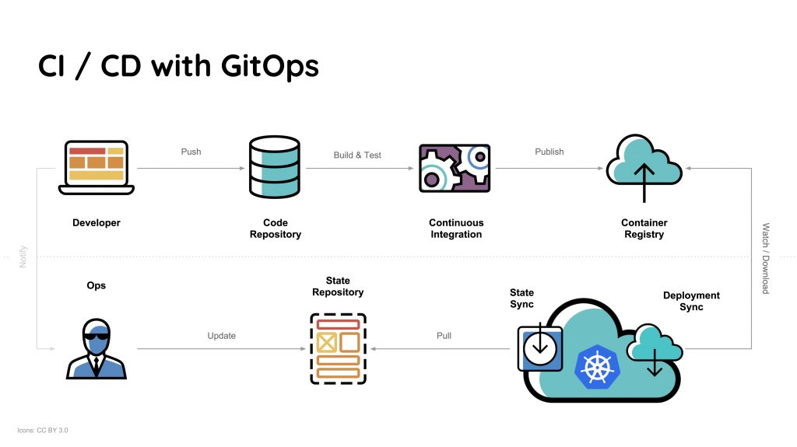

+++
title = "Rust on Nails"
date = 2022-03-16
+++

## A full stack architecture for Rust web applications


To build a web application you need to make architecture decisions across a range of topics. The beauty of Ruby on Rails is that it makes those decisions for you. The disadvantage of Ruby on Rails is your code can become brittle making even small changes scary. Rust fixes the problems with Ruby but doesn't have a Rails style opinionated framework. Until now that is.

Rust on Nails is a framework leveraging existing solutions that fulfill the needs of a full stack development. It's set of design decisions built up with over 2 years experience using Rust to build web products.

1. [Development Environment as Code](#development-environment-as-code)
1. [The Web Server and Routing](#the-web-server-and-routing)
1. [Choosing a Database](#the-database)
1. [Configuration](#configuration)
1. [Database Migrations](#database-migrations)
1. [Database Access](#database-access)
1. [HTML Templating](#html-templating)
1. [Form Handling and Validation](#forms)
1. [Asset Pipeline](#asset-pipeline)
1. [Front End Enhancement](#front-end-enhancement)
1. [Cache busting and images](#cache-busting-and-images)
1. [Layouts](#layouts)
1. [Partials and Components](#partials-and-components)
1. [Sending Email](#sending-email)
1. [Authentication](#authentication)
1. [Authorization](#authorization)
1. [Asynchronous Messaging](#asynchronous-messaging)
1. [Integration Tests](#integration-tests)
1. [Continuous Integration](#continuous-integration)
1. [Infrastructure as Code](#infrastructure-as-code)

## Development Environment as Code.

The Visual Studio Code Remote - Containers extension lets you use a Docker container as a full-featured development environment. This fixes the following problems

* Enables developers other than yourself to get quickly up to speed
* Stops issues such as "It works on my machine"
* Allows you to check your development environment into git.

Install the devcontainer extension.


The select *Open folder in container...* Select Rust and Postgres. Also select node on the next menu.


How you folder structure will look.

```sh
.
├── .cargo/
└── .devcontainer/
    ├── .env
    ├── devcontainer.json
    ├── docker-compose.yml
    └── Dockerfile
```

We are going to create a workspace for our web application. Create a new `Cargo.toml` file in the root folder and add the foloowing.

```toml
[workspace]
members = [
    "app",
]
```

The run the following command.

```
$ cargo new app
```

You should now have a folder structure like the following.

```sh
├── .devcontainer/
│   └── ...
└── app/
│   ├──src/
│   │  └── main.rs
│   └── Cargo.toml
├── Cargo.toml
└── Cargo.lock
```

Test out you development environment with

```
$ cargo run
   Compiling app v0.1.0 (/workspace/app)
    Finished dev [unoptimized + debuginfo] target(s) in 1.16s
     Running `target/debug/app`
Hello, world!
```

## The Web Server and Routing

We looked at [Actix Web](https://actix.rs/), [Tokio Axum](https://github.com/tokio-rs/axum) and [Rocket](https://rocket.rs/). Axum was chosen as it's very actively maintained and has the fastest incremental build times. 

Most rust web server project operate in a similar way. That is you configure a route and a function that will respond to that route.

The functions that respond to routes can have parameters. These parameters which might be `structs`, database pools or form data are passed to the function by the framework. 

Add the following to your `app/Cargo.toml`.

```toml
[dependencies]
axum = "0"
tokio = { version = "1", default-features = false, features = ["macros", "rt-multi-thread"] }
```

And update your `app/src/main.rs`

```rust
use axum::{response::Html, routing::get, Router};
use std::net::SocketAddr;

#[tokio::main]
async fn main() {
    // build our application with a route
    let app = Router::new().route("/", get(handler));

    // run it
    let addr = SocketAddr::from(([127, 0, 0, 1], 3000));
    println!("listening on {}", addr);
    axum::Server::bind(&addr)
        .serve(app.into_make_service())
        .await
        .unwrap();
}

async fn handler() -> Html<&'static str> {
    Html("<h1>Hello, World!</h1>")
}
```

Issue the command

```sh
cargo run
```

And you should be able to point your browser at `http://localhost:3000` and see the web server deliver **Hello World**.

## The Database

> If you're not sure which database to use then use Postgres.

The architecture doesn't stop you using MySQL (MariaDB?) or other relational databases. However a relational database is the recommendation.

We already installed Postgres when we installed our *devcontainer*, however we didn't install the Postgres command line client. To do that, add the following to your `.devcontainer/Dockerfile`.

```
RUN apt-get update && export DEBIAN_FRONTEND=noninteractive \
   && apt-get -y install postgresql-client \
   && apt-get autoremove -y && apt-get clean -y
```

Add the following to your `.devcontainer/.env`

```
DATABASE_URL=postgresql://postgres:postgres@db:5432/postgres
```

Restart your devcontainer and you should now have access to Postgres. i.e.

```
psql $DATABASE_URL
psql (13.5 (Debian 13.5-0+deb11u1), server 14.1 (Debian 14.1-1.pgdg110+1))
WARNING: psql major version 13, server major version 14.
         Some psql features might not work.
Type "help" for help.

postgres=# \dt
Did not find any relations.
postgres=# \q
```

We will use this pattern over and over. When we add a tool to our solution we add it to the devcontainer this ensures we can always reproduce our development environment. 

## Configuration

```rust
#[derive(Clone, Debug)]
pub struct Config {
    pub database_url: String,
}

impl Config {
    // Initialise form oiur environment
    pub fn new() -> Config {
        let app_database_url = 
            env::var("DATABASE_URL")
            .expect("DATABASE_URL not set");

        Config {
            app_database_url,
        }
    }
}
```

```sh
.
├── .devcontainer/
│   └── ...
├── app/
│   ├──src/
│   │  ├── main.rs
│   │  └── config.rs <- Our configuration
│   └── Cargo.toml
├── Cargo.toml
└── Cargo.lock
```

## Database Migrations

Initially in my Rust full stack web development tasks I started with [Diesel](https://diesel.rs/) which is an ORM with a really nice migration tool.

I don't use Diesel anymore, however I wasn't able to find a nicer migration tool. So I still recommend it.

Add the following to your `.devcontainer/Dockerfile`

```
RUN cargo install diesel_cli --no-default-features --features postgres
```

After that we can setup our migrations folder and the create a users migration.

```
$ diesel setup
Creating migrations directory at: /workspace/migrations

$ diesel migration generate create_users
Creating migrations/2022-03-26-161238_create_users/up.sql
Creating migrations/2022-03-26-161238_create_users/down.sql
```

Migrations are standard SQL. Add this one to your up.sql that was generated for you.


```sql
CREATE TABLE users (
    id SERIAL PRIMARY KEY, 
    email VARCHAR NOT NULL UNIQUE, 
    hashed_password VARCHAR NOT NULL, 
    reset_password_selector VARCHAR NOT NULL,
    reset_password_verifier_hash VARCHAR NOT NULL,
    created_at TIMESTAMP NOT NULL DEFAULT NOW(),
    updated_at TIMESTAMP NOT NULL DEFAULT NOW()
);
```

We also need to reverse the migration if necessary. Add this one to your down.sql.

```sql
DROP TABLE users;
```

```sh
.
├── .devcontainer/
│   └── ...
├── app/
│   └── ...
├── migrations/
│   └── 00000000000_diesel_initial_setup/
│   │   └── ...
│   └── 2021-12-04-123053_create_users
│       ├── down.sql
│       └── up.sql
├── Cargo.toml
└── Cargo.lock
```

List the migration s so we can see which have run.

```
$ diesel migration list
Migrations:
  [X] 00000000000000_diesel_initial_setup
  [ ] 2022-03-26-161238_create_users
```

Run our new migration.

```
$ diesel migration run
Running migration 2022-03-26-161238_create_users
```

And check that it worked.

```
$ psql $DATABASE_URL -c 'SELECT count(*) FROM users;'
 count 
-------
     0
(1 row)
```

## Database Access

[SQLx](https://github.com/launchbadge/sqlx) is amazing. It's An async, pure Rust SQL crate featuring compile-time checked queries without a DSL. Supports PostgreSQL, MySQL, SQLite, and MSSQL.

Add the following to your `app/Cargo.toml`

```
sqlx = { version = "0", default-features = false,  features = [ "runtime-tokio-rustls", "postgres", "macros", "chrono" ] }
```

If you already know SQL then the learning curve is short and the code is much easier to read than [Diesel](https://diesel.rs/).

Add the following code to a file called `app/src/models/user.rs`

```rust
use sqlx::{PgPool, Error};

pub struct User {
    pub id: i32,
    pub email: String,
}

impl User {
    pub async fn get_user(pool: &PgPool, user_id: u32) -> Result<User, Error> {
        Ok(sqlx::query_as!(
            User,
            "
                SELECT 
                    id, email
                FROM 
                    users
                WHERE
                    id = $1
            ",
            user_id as i32
        )
        .fetch_one(pool)
        .await?)
    }
}
```

You'll also need to create a file called `app/src/models/mod.rs` and add the following

```
pub mod user;
```

We recommend creating a folder called models and adding a file for each type of entity you will manipulate with SQLx.

```sh
.
├── .devcontainer/
│   └── ...
├── app
│   ├── src/
│   │   ├── models/
│   │   │   ├── main.rs
│   │   │   └── mod.rs
│   │   ├── main.rs
│   │   └── config.rs
├── migrations/
│   └── ...
├── Cargo.toml
└── Cargo.lock
```

## HTML Templating

[markup.rs](https://github.com/utkarshkukreti/markup.rs)

```rust
markup::define! {
    Page<'a>(user: &'a User, posts: &'a [Post]) {
        @markup::doctype()
        html {
            head {
                title { "Hello " @user.name }
            }
            body {
                #main.container {
                    @for post in *posts {
                        div#{format!("post-{}", post.id)}["data-id" = post.id] {
                            .title { @post.title }
                        }
                    }
                }
                @Footer { name: &user.name, year: 2020 }
            }
        }
    }

    Footer<'a>(name: &'a str, year: u32) {
        "(c) " @year " " @name
    }
}
```

## Forms

```rust
use axum::{
    extract::Form,
    handler::post,
    Router,
};
use serde::Deserialize;

#[derive(Deserialize)]
struct SignUp {
    username: String,
    password: String,
}

async fn accept_form(form: Form<SignUp>) {
    let sign_up: SignUp = form.0;

    // ...
}

let app = Router::new().route("/sign_up", post(accept_form));
```

## Asset Pipeline

The asset pipeline provides a framework to concatenate and minify or compress JavaScript and CSS assets. It also adds the ability to write these assets in other languages and pre-processors such as [Typescript](https://www.typescriptlang.org/) and [Sass](https://sass-lang.com/).

I've used [Parcel](https://parceljs.org/) on several projects and before that [Webpack](https://webpack.js.org/). I've found Parcel to be easier to use and so that is the recommendation for Nails.


```sh
.
├── .devcontainer/
│   └── ...
├── app
│   ├── asset-pipeline/
│   │   ├── scss/
│   │   │   └── index.scss
│   │   └── index.ts
│   ├── src/
│   │   └── ...
├── migrations/
│   └── ...
├── Cargo.toml
└── Cargo.lock
```

## Front end enhancement

Sometimes you need to enhance server side generated HTML. There are many ways to do this for example [Stimulus](https://stimulus.hotwired.dev/), which I've used on multiple projects.

```js
//define a class extending HTMLElement
class HelloWorld extends HTMLElement {
    connectedCallback () {
      this.innerHTML = 'Hello, World!'
    }
}

//register the new custom element
customElements.define( 'hello-world', HelloWorld )
```

To use the element

```html
<hello-world></hello-world>
```

## Cache Busting and Images

## Layouts

Layouts are pieces that fit together (for example header, footer, menus, etc) to make a complete view. An application may have as many layouts as needed. 

In Nails a layout is just a function that takes HTML content and returns more HTML content.

## Partials and Components

## Sending Email

```yaml
# MailHog is an email testing tool for developers.
smtp:
    image: mailhog/mailhog
```


## Authentication

Barricade and others.

## Authorization

## Jobs

## Asynchronous Messaging

[RabbitMQ](https://www.rabbitmq.com/)

## Integration Tests

> Production Example 
> [Cloak Integration Tests](https://github.com/purton-tech/cloak/tree/main/app/tests) and
> [Cloak docker-compose.yml](https://github.com/purton-tech/cloak/blob/main/.devcontainer/docker-compose.yml)

```yaml
  # Integration testing using a headless chrome browser
  selenium:
    image: selenium/standalone-chrome:4.1.1-20220121
    shm_size: 2gb
    environment:
      VNC_NO_PASSWORD: 1
    ports:
      # VNC
      - 7105:5900
      # No VNC
      - 7106:7900
```

## Continuous Integration

Whichever framework you use and unless you have a very good reason not to, then I would say a CICD pipeline should produce 1 or more docker containers.

This then gives you the maximum flexibility in the way your application is deployed. Containers wrap up an executable with all it's depedencies.



## Infrastructure as Code

Pulumi


```sh
├── .devcontainer/
│   └── ...
├── app/
│   └── ...
├── infra/
│   ├── node_modules/
│   ├── index.ts
│   ├── package-lock.json
│   ├── package.json
│   ├── Pulumi.yaml
│   ├── Pulumi-test.yaml
│   └── tsconfig.json
└── migrations/
    └── ...
```

## CD

## Conclusion

